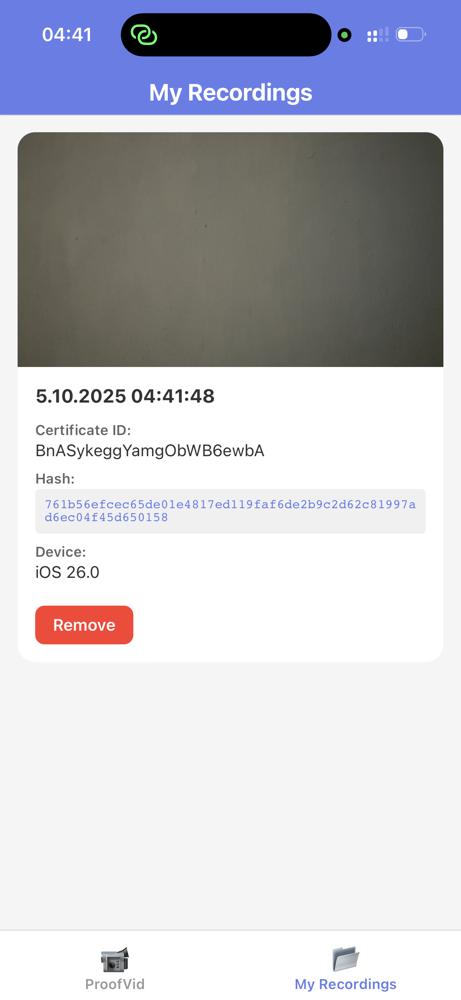

# 🎥 ProofVid - Video Authentication System

ProofVid is a complete video authentication system that allows users to record videos on their iPhone and receive a certificate of authenticity based on the SHA-256 hash of the video. The hash is calculated **locally on the device** and only the hash (not the video) is sent to the server for registration.

## 🌟 Features

- **Privacy-First**: Videos never leave your device - only the hash is transmitted
- **Local Hash Calculation**: SHA-256 hash computed on the iPhone
- **Certificate Generation**: Unique certificate ID for each registered video
- **Web Verification**: Anyone can verify a video's authenticity via the web interface
- **Multiple Verification Methods**: Verify by video file, hash, or certificate ID
- **Timestamp Tracking**: Records when each video was authenticated
- **Device Information**: Tracks which device registered the video

<p style="color:#d32f2f; margin-top: 8px;">
  <strong>Important:</strong> Please make sure to read the <a href="#disclaimer">Disclaimer</a> before using this project.
</p>

## 📁 Project Structure

```
ProofVid/
├── backend/                 # Flask server
│   ├── app.py              # Main server application
│   ├── requirements.txt    # Python dependencies
│   ├── templates/
│   │   └── index.html      # Web verification interface
│   └── proofvid.db         # SQLite database (created on first run)
│
└── ios-app/                # React Native iOS app
    ├── App.js              # Main app component
    ├── package.json        # Node dependencies
    └── ...
```

### 📸 Screenshots

<table>
  <tr>
    <td align="center">
      <br/>
      <sub><em>Recording screen</em></sub>
    </td>
    <td align="center">
      <br/>
      <sub><em>My Recordings tab</em></sub>
    </td>
  </tr>
  
</table>

## 🚀 Setup Instructions

### Backend Server Setup

1. **Navigate to backend directory**:
   ```bash
   cd backend
   ```

2. **Create a virtual environment** (recommended):
   ```bash
   python3 -m venv venv
   source venv/bin/activate  # On Mac/Linux
   ```

3. **Install dependencies**:
   ```bash
   pip install -r requirements.txt
   ```

4. **Run the server**:
   ```bash
   python app.py
   ```

   The server will start on `http://0.0.0.0:5050`

5. **Access the web interface**:
   Open your browser and go to `http://localhost:5050`

### iOS App Setup

1. **Prerequisites**:
   - Node.js (v16 or higher)
   - Expo Go app installed on your iPhone (from App Store)

2. **Navigate to iOS app directory**:
   ```bash
   cd ios-app
   ```

3. **Install dependencies**:
   ```bash
   npm install
   ```

4. **Configure environment variables**:
   ```bash
   cp .env.example .env
   ```
   
   Then edit `.env` and update the API URL:
   ```
   EXPO_PUBLIC_API_URL=http://YOUR_SERVER_IP:5050
   ```
   
   - Replace `YOUR_SERVER_IP` with your computer's local IP address
   - To find your IP on Mac: `ifconfig | grep "inet " | grep -v 127.0.0.1`
   - To find your IP on Windows: `ipconfig`
   - Example: `EXPO_PUBLIC_API_URL=http://192.168.1.100:5050`

5. **Start Expo development server**:
   ```bash
   npm start
   ```

6. **Run on your iPhone**:
   - Open Camera app on iPhone
   - Scan the QR code shown in terminal
   - App will open in Expo Go
   - Make sure your iPhone and computer are on the same WiFi network

## 📱 How to Use

### Recording and Authenticating a Video

1. **Open the ProofVid app** on your iPhone
2. **Grant camera and microphone permissions** when prompted
3. **Record a video**:
   - Tap the red record button to start
   - Tap again to stop recording
4. **Or select an existing video** from your library using the folder icon
5. **Wait for processing**:
   - The app calculates the SHA-256 hash locally
   - The hash is sent to the server
   - You receive a certificate with a unique ID
6. **Save your certificate ID** - you'll need it to verify the video later

### Verifying a Video

Visit the ProofVid website (your server URL) and use one of three methods:

1. **Verify by Video File**:
   - Upload the video file
   - The website calculates the hash in your browser
   - Checks if it's registered

2. **Verify by Hash**:
   - Enter the SHA-256 hash directly
   - Useful if you already know the hash

3. **Verify by Certificate ID**:
   - Enter the certificate ID you received
   - View the associated hash and metadata

## 🔧 API Endpoints

### POST `/api/register`
Register a new video hash and receive a certificate.

**Request Body**:
```json
{
  "hash": "sha256_hash_here",
  "device_info": "iOS 16.0",
  "location": "optional",
  "metadata": "optional_json_string"
}
```

**Response**:
```json
{
  "success": true,
  "certificate_id": "unique_cert_id",
  "hash": "sha256_hash_here",
  "timestamp": "2024-01-01T12:00:00Z",
  "message": "Video hash registered successfully"
}
```

### GET `/api/verify/<hash>`
Verify if a video hash is registered.

**Response**:
```json
{
  "verified": true,
  "certificate_id": "unique_cert_id",
  "hash": "sha256_hash_here",
  "timestamp": "2024-01-01T12:00:00Z",
  "device_info": "iOS 16.0"
}
```

### GET `/api/certificate/<certificate_id>`
Get certificate details by ID.

**Response**:
```json
{
  "found": true,
  "certificate_id": "unique_cert_id",
  "hash": "sha256_hash_here",
  "timestamp": "2024-01-01T12:00:00Z",
  "device_info": "iOS 16.0"
}
```

### GET `/api/stats`
Get system statistics.

**Response**:
```json
{
  "total_certificates": 42
}
```

## 🔒 Security Features

- **No Video Upload**: Videos are never transmitted to the server
- **Cryptographic Hash**: SHA-256 ensures video integrity
- **Unique Certificates**: Each registration gets a unique certificate ID
- **Timestamp Verification**: Records exact time of registration
- **Tamper Detection**: Any modification to the video changes its hash

## 🛠️ Technology Stack

### Backend
- **Flask**: Python web framework
- **SQLite**: Lightweight database for certificate storage
- **Flask-CORS**: Cross-origin resource sharing

### iOS App
- **React Native**: Cross-platform mobile framework
- **react-native-vision-camera**: Camera access and video recording
- **react-native-fs**: File system access for reading video files
- **react-native-crypto-js**: SHA-256 hash calculation
- **axios**: HTTP client for API requests

### Web Interface
- **Vanilla JavaScript**: No framework dependencies
- **Web Crypto API**: Browser-based SHA-256 calculation
- **Responsive Design**: Works on desktop and mobile browsers

## 📝 Development Notes

### Running with Expo Go

1. Install Expo Go from the App Store on your iPhone
2. Make sure your iPhone and computer are on the same WiFi network
3. Start the Expo dev server with `npm start`
4. Scan the QR code with your iPhone camera
5. The app will open in Expo Go automatically

### Building a Standalone App (Optional)

To build a standalone iOS app without Expo Go:
```bash
npm install -g eas-cli
eas build --platform ios
```

### Database

The SQLite database (`proofvid.db`) is created automatically on first run. It contains a single table:

```sql
CREATE TABLE certificates (
    id INTEGER PRIMARY KEY AUTOINCREMENT,
    video_hash TEXT UNIQUE NOT NULL,
    certificate_id TEXT UNIQUE NOT NULL,
    timestamp TEXT NOT NULL,
    device_info TEXT,
    location TEXT,
    metadata TEXT
)
```

## 🚧 Future Enhancements

- [ ] Blockchain integration for immutable certificate storage
- [ ] GPS location tracking (with user permission)
- [ ] Batch verification of multiple videos
- [ ] Export certificates as PDF
- [ ] QR code generation for easy sharing
- [ ] Video metadata extraction (duration, resolution, etc.)
- [ ] User accounts and authentication
- [ ] Certificate expiration and renewal
- [ ] Android app support

## 📄 License

This project is open source and available for educational purposes.

## 🤝 Contributing

Contributions are welcome! Please feel free to submit issues or pull requests.

<a id="disclaimer"></a>
## ⚠️ Disclaimer

This is a proof-of-concept application. For production use, consider:
- Allowing the app to only create videos on non-rooted (secure) devices
- Using HTTPS for all communications
- Implementing user authentication
- Adding rate limiting to prevent abuse
- Using a production-grade database (PostgreSQL, MySQL)
- Implementing proper error handling and logging
- Adding backup and recovery mechanisms

### Security and Authenticity

- To strengthen trust, consider:
  - Hardware-backed attestation and signing (iOS App Attest/Secure Enclave; Android Play Integrity/Key attestation - this is for future development as Android is not supported yet).
  - Challenge–response with short-lived nonces signed by the device key alongside the video hash.
  - Blocking rooted/jailbroken/emulator devices; enable TLS pinning and anti-tamper checks.

---

By Hüseyin